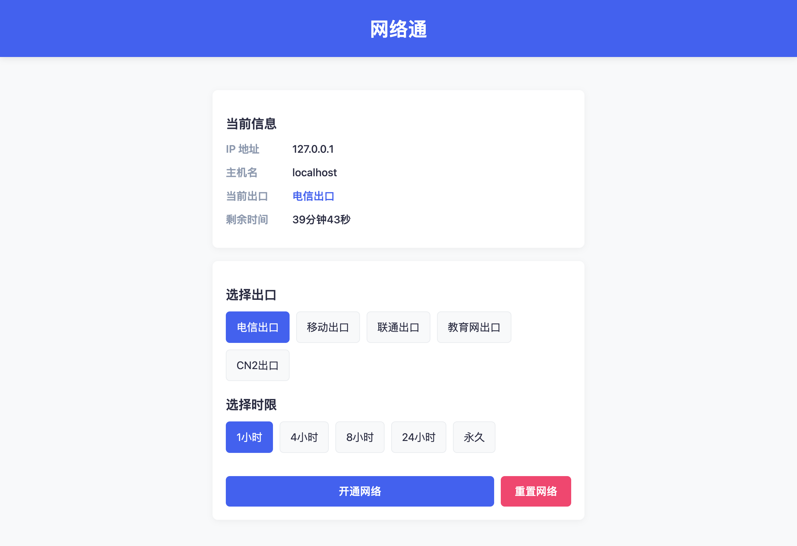

<!-- Keep these links. Translations will automatically update with the README. -->
[Deutsch](https://zdoc.app/de/gaoyifan/wlt) | 
[English](https://zdoc.app/en/gaoyifan/wlt) | 
[Español](https://zdoc.app/es/gaoyifan/wlt) | 
[français](https://zdoc.app/fr/gaoyifan/wlt) | 
[日本語](https://zdoc.app/ja/gaoyifan/wlt) | 
[한국어](https://zdoc.app/ko/gaoyifan/wlt) | 
[Português](https://zdoc.app/pt/gaoyifan/wlt) | 
[Русский](https://zdoc.app/ru/gaoyifan/wlt) | 
[中文](https://zdoc.app/zh/gaoyifan/wlt)

# 网络通 (wlt)

网络通是一个基于 Python Flask 和 Nftables 的轻量级网络出口管理器。复刻自 [wlt.ustc.edu.cn](http://wlt.ustc.edu.cn)。

它允许用户通过 Web 界面为自己的设备（基于 IP 地址）选择特定的网络出口（如电信、联通、CN2 等），并支持设置访问时长（自动过期）。

## 功能特点

*   **Nftables 深度结合**：直接操作 Nftables Map，以此作为唯一数据源，不依赖任何外部数据库，确保状态绝对一致。
*   **Web 界面管理**：简洁的网页 UI，展示当前 IP、主机名及当前连接的出口状态。
*   **多出口切换**：支持配置多个网络出口，通过设置 fwmark 配合策略路由实现流量调度。
*   **自动过期**：利用 Nftables 的原生 timeout 特性，支持设置访问时长（如 1小时、4小时、永久），到期自动恢复默认。



## 📖 原理说明：Linux 路由器与本项目

本项目通常运行在充当路由器的 Linux 服务器上。其核心工作原理如下：

1.  **fwmark (Firewall Mark)**: Linux 内核允许给网络数据包打上一个整数标记（Mark）。
2.  **Nftables Map**: 本程序维护一个 Nftables Map (`src_ip : mark`)。当数据包经过路由器时，Nftables 会根据源 IP 自动查询该 Map，如果存在记录，则将对应的 Mark 打在数据包上。
3.  **策略路由 (Policy Routing)**: 操作系统根据数据包上的 Mark 选择不同的路由表。
    *   例如：Mark 为 `0x1` 的包走电信网关，Mark 为 `0x2` 的包走移动网关。
4.  **自动过期**: Nftables Map 支持为元素设置超时时间。时间一到，内核会自动移除该记录，该 IP 的流量将不再被打上特定 Mark，从而回落到默认路由。

**本项目的角色仅限于第 2 步**：提供一个 Web 界面让用户修改 Nftables Map 中的记录。你需要自行配置第 3 步的策略路由。

## 部署指南 (Docker)

本项目推荐使用 Docker Compose 部署。

### 1. 准备 Nftables 规则

你需要在宿主机上预先加载 Nftables 基础规则，确保存在用于存放映射关系的 Map。

参考 `nft/demo.nft`：
```nft
table inet wlt {
    map src2mark {
        type ipv4_addr : mark
        flags interval, timeout
    }
    
    chain prerouting {
        type filter hook prerouting priority mangle - 1; policy accept;
        # 核心逻辑：查询 Map 并设置 fwmark
        meta mark set ip saddr map @src2mark
    }
}
```

加载规则：
```bash
nft -f nft/demo.nft
```

### 2. 配置文件

复制示例配置并修改：

```bash
cp config.example.toml config.toml
```

编辑 `config.toml`：

```toml
time_limits = [1, 4, 8, 24, 0] # 0 代表永久

[[outlet_groups]]
title = "选择出口"
mask = 0xFF
[outlet_groups.outlets]
电信出口 = 0x1
移动出口 = 0x2

[[outlet_groups]]
title = "路由策略"
mask = 0xF00
[outlet_groups.outlets]
默认 = 0x0
覆盖CN路由 = 0x100
```

#### 配置详解

| 配置项 | 默认值 | 说明 |
| :--- | :--- | :--- |
| `flask.host` | `0.0.0.0` | Web 服务监听地址 |
| `flask.port` | `80` | Web 服务监听端口 |
| `flask.debug` | `true` | 是否开启 Flask 调试模式 |
| `nftables.family` | `inet` | Nftables 协议族 (inet/ip/ip6) |
| `nftables.table` | `wlt` | Nftables 表名 |
| `nftables.map` | `src2mark` | 存储 IP 映射关系的 Map 名 |
| `outlet_groups` | **(必填)** | 出口组列表，包含 `title`、`mask` 和 `outlets` |
| `time_limits` | **(必填)** | 可选时长列表（小时），`0` 表示永久 |

### 3. 启动服务

```bash
docker compose up -d
```

⚠️ **注意**：
*   必须使用 `network_mode: host`，否则程序无法获取用户真实 IP，也无法操作宿主机的 Nftables。
*   容器需要 `NET_ADMIN` 权限。

## 持久化与注意事项

1.  **重启丢失问题**：Nftables 的 Map 数据（即用户的出口选择状态）存储在内核内存中。**服务器重启后，这些状态会被重置，所有用户将恢复到默认出口**。
    *   如果需要持久化，你需要在关机前使用 `nft list ruleset > file` 保存，并在开机后加载。但考虑到出口通常有有效期，重启重置通常也是可接受的行为。
2.  **路由配置**：请务必确保你的 Linux 系统已经配置了对应的 `ip rule` 和 `ip route`。
    *   示例：`ip rule add fwmark 0x1 table 100` (表 100 包含走电信的默认路由)

## License

MIT
