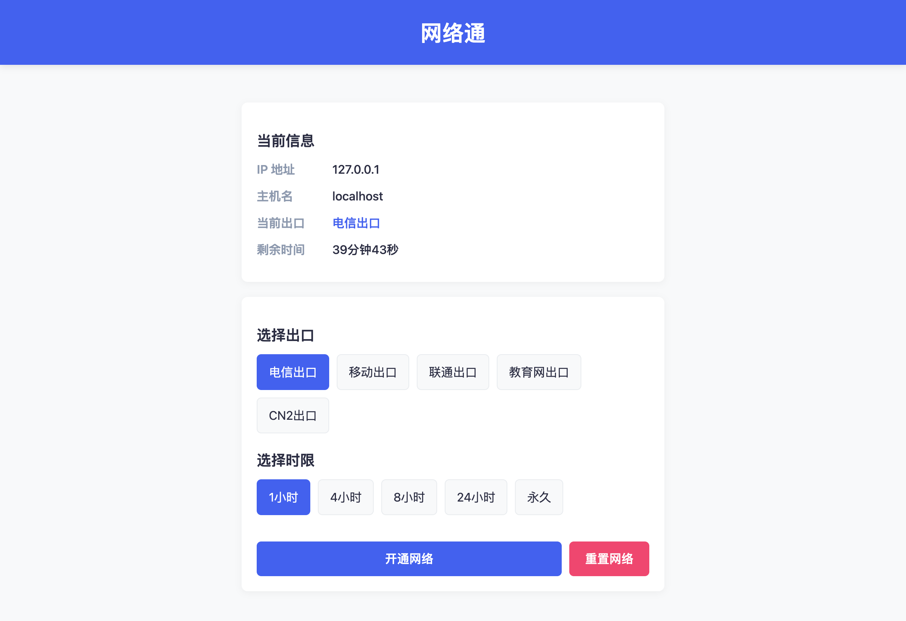

<!-- Keep these links. Translations will automatically update with the README. -->
[Deutsch](https://zdoc.app/de/gaoyifan/wlt) | 
[English](https://zdoc.app/en/gaoyifan/wlt) | 
[Español](https://zdoc.app/es/gaoyifan/wlt) | 
[français](https://zdoc.app/fr/gaoyifan/wlt) | 
[日本語](https://zdoc.app/ja/gaoyifan/wlt) | 
[한국어](https://zdoc.app/ko/gaoyifan/wlt) | 
[Português](https://zdoc.app/pt/gaoyifan/wlt) | 
[Русский](https://zdoc.app/ru/gaoyifan/wlt) | 
[中文](https://zdoc.app/zh/gaoyifan/wlt)

# 网络通 (wlt)

网络通是一个基于 Rust 和 Nftables 的轻量级网络出口管理器。复刻自 [wlt.ustc.edu.cn](http://wlt.ustc.edu.cn)。

它允许用户通过 Web 界面或 SSH 终端为自己的设备（基于 IP 地址）选择特定的网络出口（如电信、联通、CN2 等），并支持设置访问时长（自动过期）。

## 功能特点

*   **单一二进制**：一个 `wlt` 可执行文件，按配置启用 Web 门户（HTTP/HTTPS）、SSH TUI 与持久化服务，全部跑在同一个进程内。
*   **Nftables 深度结合**：通过 nftables JSON API 直接操作 Nftables Map，以此作为唯一数据源，不依赖任何外部数据库，确保状态绝对一致。
*   **Web 界面管理**：简洁的网页 UI，展示当前 IP、主机名及当前连接的出口状态；支持双栈（IPv4/IPv6）分栏管理。
*   **SSH 终端管理**：`ssh -p 2222 <host>` 免认证进入交互式菜单，适合无浏览器环境。
*   **多出口切换**：支持配置多个网络出口，通过设置 fwmark 配合策略路由实现流量调度。
*   **自动过期**：利用 Nftables 的原生 timeout 特性，支持设置访问时长（如 1小时、4小时、永久），到期自动恢复默认。



## 📖 原理说明：Linux 路由器与本项目

本项目通常运行在充当路由器的 Linux 服务器上。其核心工作原理如下：

1.  **fwmark (Firewall Mark)**: Linux 内核允许给网络数据包打上一个整数标记（Mark）。
2.  **Nftables Map**: 本程序维护一个 Nftables Map (`src_ip : mark`)。当数据包经过路由器时，Nftables 会根据源 IP 自动查询该 Map，如果存在记录，则将对应的 Mark 打在数据包上。
3.  **策略路由 (Policy Routing)**: 操作系统根据数据包上的 Mark 选择不同的路由表。
    *   例如：Mark 为 `0x1` 的包走电信网关，Mark 为 `0x2` 的包走移动网关。
4.  **自动过期**: Nftables Map 支持为元素设置超时时间。时间一到，内核会自动移除该记录，该 IP 的流量将不再被打上特定 Mark，从而回落到默认路由。

**本项目的角色仅限于第 2 步**：提供 Web/SSH 界面让用户修改 Nftables Map 中的记录。你需要自行配置第 3 步的策略路由。

## 部署指南 (Docker)

本项目推荐使用 Docker Compose 部署。

### 1. 准备 Nftables 规则

你需要在宿主机上预先加载 Nftables 基础规则，确保存在用于存放映射关系的 Map。

参考 `nft/demo.nft`：
```nft
table inet wlt {
    map src2mark {
        type ipv4_addr : mark
        flags interval, timeout
    }
    
    chain prerouting {
        type filter hook prerouting priority mangle - 1; policy accept;
        # 核心逻辑：查询 Map 并设置 fwmark
        meta mark set ip saddr map @src2mark
    }
}
```

加载规则：
```bash
nft -f nft/demo.nft
```

### 2. 配置文件

复制示例配置并修改：

```bash
cp config.example.toml config.toml
```

服务按配置段落启用：出现 `[web]` 即启用 Web 门户，出现 `[ssh]` 即启用
SSH TUI，出现 `[persist]` 即启用持久化，全部由同一个进程承载：

```toml
time_limits = [1, 4, 8, 24, 0] # 0 代表永久

[web]
listen = "[::]:80"
# 可选 HTTPS（与 HTTP 提供相同路由）：
# [web.https]
# listen = "[::]:443"
# cert = "/etc/ssl/private/example/fullchain.pem"
# key = "/etc/ssl/private/example/privkey.pem"

[ssh]
listen = "[::]:2222"
host_key = "/data/ssh_host_key"   # 缺失时自动生成

[persist]
path = "/etc/nftables/wlt_src2mark.conf"
interval = 300

[[outlet_groups]]
title = "选择出口"
mask = 0xFF
[outlet_groups.outlets]
电信出口 = 0x1
移动出口 = 0x2

[[outlet_groups]]
title = "路由策略"
mask = 0xF00
[outlet_groups.outlets]
默认 = 0x0
覆盖CN路由 = 0x100
```

#### 补充配置目录

可以在 `config.d/` 中放置任意数量的 `*.toml` 补充配置。程序先读取
`config.toml`，再按文件名字符序依次深合并，例如：

```toml
# config.d/10-extra-outlets.toml
[[outlet_groups]]
title = "国内出口"
[outlet_groups.outlets]
"测试出口1" = 0xfd00
"测试出口2" = 0xfe00

[[outlet_groups]]
title = "海外出口"
[outlet_groups.outlets]
"测试出口1" = 0xfd
"测试出口2" = 0xfe
```

`outlet_groups` 按 `title` 合并，组内的 `outlets` 按出口名称合并；同名值由
文件名排序靠后的配置覆盖。其他字典递归合并，普通列表（如
`time_limits`）整体覆盖。非 `*.toml` 文件和子目录会被忽略。

#### 禁用 IPv6 转发

如果 IPv6 出口配置中保留 `0xff00` 和 `0xff` 作为“禁用 IPv6”，宿主机需要把最终 `fwmark 0xff` 指向一张拒绝路由表。例如在 IPv6 策略路由脚本中加入：

```iproute2
rule add pref 10 lookup 5255 fwmark 0xff/0xff
route replace unreachable default table 5255
```

当前 nftables 的 IPv6 打标逻辑会对国内目的地址使用 mark 高字节（`>> 8`），对海外目的地址使用 mark 低字节（`& 0xff`）。因此用户可以只禁用国内 IPv6、只禁用海外 IPv6，或两个分组都选择“禁用 IPv6”。

#### 持久化出口设置

启用 `[persist]` 后，程序每 `interval` 秒（默认 5 分钟）将 `src2mark`
保存到 `path`（默认 `/etc/nftables/wlt_src2mark.conf`），仅在内容变化时
原子写入。Compose 已将宿主机 `/etc/nftables/` 挂载到容器。

在宿主机的 `/etc/nftables.conf` 中，必须在 `inet wlt` 表和
`src2mark` map 创建完成后引用快照：

```nft
include "/etc/nftables/wlt_src2mark.conf"
```

限时元素会保存原始 timeout 和当前剩余 expires。nftables 或主机重启后，
计时从最后保存的剩余时间继续；主机停机期间暂停计时。异常宕机最多丢失最近
5 分钟内的设置变更。

#### 配置详解

| 配置项 | 默认值 | 说明 |
| :--- | :--- | :--- |
| `web.listen` | `0.0.0.0:80` | Web 服务监听地址（`[::]:80` 为双栈） |
| `web.https.listen` | - | HTTPS 监听地址（需同时提供 `cert`/`key`） |
| `ssh.listen` | `[::]:2222` | SSH TUI 监听地址 |
| `ssh.host_key` | `ssh_host_key` | SSH host key 路径，缺失时自动生成（Ed25519） |
| `persist.path` | `/etc/nftables/wlt_src2mark.conf` | 快照文件路径 |
| `persist.interval` | `300` | 快照间隔（秒） |
| `nftables.family` | `inet` | Nftables 协议族 (inet/ip/ip6) |
| `nftables.table` | `wlt` | Nftables 表名 |
| `nftables.map` | `src2mark` | 存储 IPv4 映射关系的 Map 名 |
| `nftables.map_v6` | `None` | 存储 IPv6 映射关系的 Map 名；配置后可选择 IPv6 出口或“禁用 IPv6” |
| `portal.v4_host` / `portal.v6_host` | `None` | 双栈 SPA 的分横线（split-horizon）主机名 |
| `portal.cors_domain` | `None` | 允许跨域访问 API 的域名（含子域名）；缺省关闭 CORS |
| `outlet_groups` | **(必填)** | 出口组列表，包含 `title`、`mask` 和 `outlets` |
| `outlet_groups[].cn_last` | `false` | 为 `true` 时把名称以 `CN ` 开头的出口排到该组列表末尾（仅影响展示顺序，不改变 mark） |
| `time_limits` | **(必填)** | 可选时长列表（小时），`0` 表示永久 |

### 3. 启动服务

```bash
docker compose up -d
```

⚠️ **注意**：
*   必须使用 `network_mode: host`，否则程序无法获取用户真实 IP，也无法操作宿主机的 Nftables。
*   容器需要 `NET_ADMIN` 权限。

## 本地开发

```bash
cargo test          # 单元测试
cargo run -- --config config.toml
```

## 持久化与注意事项

1.  **重启丢失问题**：Nftables 的 Map 数据（即用户的出口选择状态）存储在内核内存中。**服务器重启后，这些状态会被重置，所有用户将恢复到默认出口**。
    *   启用 `[persist]` 并在 nftables 启动配置中 include 快照文件即可跨重启恢复（见上文）。
2.  **路由配置**：请务必确保你的 Linux 系统已经配置了对应的 `ip rule` 和 `ip route`。
    *   示例：`ip rule add fwmark 0x1 table 100` (表 100 包含走电信的默认路由)

## License

MIT
